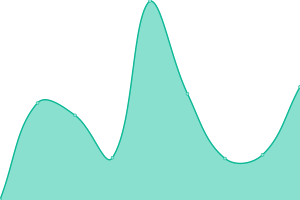
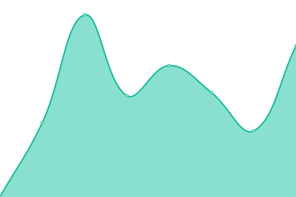
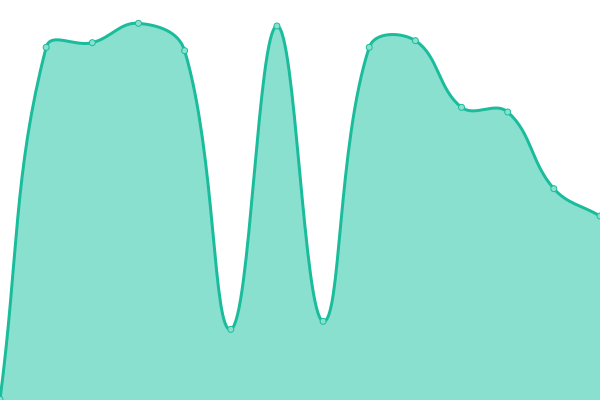

# [📈 Live Status](https://DivaHQ.github.io/upptime): <!--live status--> **🟥 Complete outage**

This repository contains the open-source uptime monitor and status page for [Anish Thite](DivaHQ.github.io), powered by [Upptime](https://github.com/upptime/upptime).

With [Upptime](https://upptime.js.org), you can get your own unlimited and free uptime monitor and status page, powered entirely by a GitHub repository. We use [Issues](https://github.com/DivaHQ/upptime/issues) as incident reports, [Actions](https://github.com/DivaHQ/upptime/actions) as uptime monitors, and [Pages](https://DivaHQ.github.io/upptime) for the status page.

<!--start: status pages-->
<!-- This summary is generated by Upptime (https://github.com/upptime/upptime) -->
<!-- Do not edit this manually, your changes will be overwritten -->
<!-- prettier-ignore -->
| URL | Status | History | Response Time | Uptime |
| --- | ------ | ------- | ------------- | ------ |
|  [Shop Site](https://shop.claros.so) | 🟥 Down | [shop-site.yml](https://github.com/ClarosAI/upptime/commits/HEAD/history/shop-site.yml) | 

 0ms
     
 | 

<a href="https://ClarosAI.github.io/upptime/history/shop-site">0.00%</a>
    

|  [Backend](https://back.claros.so) | 🟥 Down | [backend.yml](https://github.com/ClarosAI/upptime/commits/HEAD/history/backend.yml) | 

 0ms
     
 | 

<a href="https://ClarosAI.github.io/upptime/history/backend">0.00%</a>
    

|  [Dev Backend](https://the-back-dev.claros.so) | 🟥 Down | [dev-backend.yml](https://github.com/ClarosAI/upptime/commits/HEAD/history/dev-backend.yml) | 

 0ms
     
 | 

<a href="https://ClarosAI.github.io/upptime/history/dev-backend">0.00%</a>
    

<!--end: status pages-->

[**Visit our status website →**](https://DivaHQ.github.io/upptime)

## 📄 License

- Powered by: [Upptime](https://github.com/upptime/upptime)
- Code: [MIT](./LICENSE) © [Anish Thite](anishthite.github.io)
- Data in the `./history` directory: [Open Database License](https://opendatacommons.org/licenses/odbl/1-0/)
